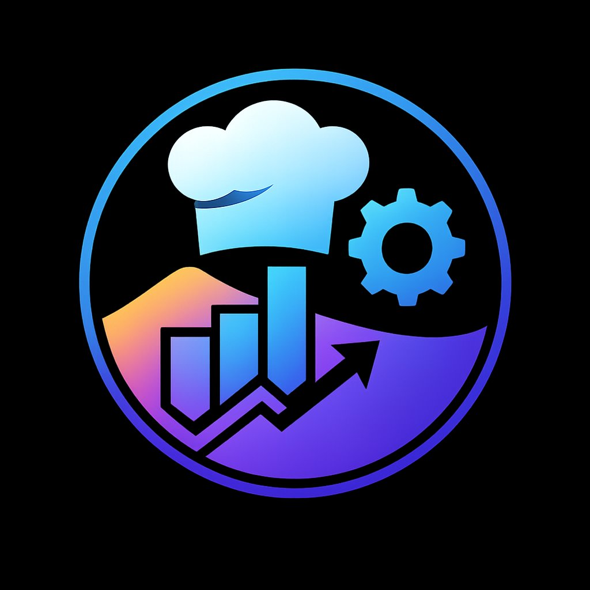

<div align="center">
  
</div>

# 📊 WPC Broadsheet Manager — Android App

[](https://kotlinlang.org/)
[](https://developer.android.com/jetpack/compose)
[](https://m3.material.io/)
[](https://developer.android.com/training/data-storage/room)

A cutting-edge Android application designed to replace the legacy Excel-based broadsheet system for **Western Province Caterers**. Built with a focus on speed, reliability, and a premium user experience.

---

## ✨ Features

- ⚡ **Real-time Billing**: Instant calculation of meal counts, VAT, and final totals as you type.
- 🏢 **Multi-Site Management**: Effortlessly switch between different catering units.
- 👥 **Resident Management**: Full CRUD operations for managing residents and their meal plans.
- 📈 **Advanced Reporting**: Visual dashboards and monthly history tracking.
- 💾 **Offline First**: Robust local storage using **Room Database** with background sync capabilities.
- 🌓 **Theming**: Premium dark-mode first design using **Syne** and **DM Sans** typography.
- 🔔 **Smart Reminders**: Integrated **WorkManager** for capture reminders and background tasks.
- 📤 **Export Capabilities**: Export data to professional formats (Phase 2).

---

## 🛠️ Tech Stack

- **UI**: Jetpack Compose (100% Declarative UI)
- **Architecture**: MVVM (Model-View-ViewModel) + Repository Pattern
- **Navigation**: Compose Navigation with Type-Safe Routes
- **Database**: Room Persistence Library
- **Local Storage**: Preferences DataStore (User Settings)
- **Networking**: Retrofit 3.0 + OkHttp 5.0 (Ready for API integration)
- **Dependency Management**: Gradle Version Catalog (libs.versions.toml)
- **Image Loading**: Coil-Compose
- **Background Tasks**: WorkManager

---

## 📁 Project Architecture

```
WPCBroadsheet/
├── app/src/main/java/com/hildebrandtdigital/wpcbroadsheet/
│   ├── data/
│   │   ├── db/              ← Room Database & DAOs
│   │   ├── model/           ← Type-safe Data Classes
│   │   ├── network/         ← API Interfaces & Retrofit Config
│   │   └── repository/      ← Single source of truth for data
│   ├── ui/
│   │   ├── components/      ← Reusable UI Atoms & Molecules
│   │   ├── navigation/      ← NavHost & Route definitions
│   │   ├── screens/         ← Full-page Composable screens
│   │   └── theme/           ← Material3 Design Tokens (Colors, Type)
│   └── workers/             ← WorkManager background tasks
```

---

## 🚀 Getting Started

### Prerequisites
- Android Studio Ladybug (or newer)
- JDK 21
- Android SDK 36 (Compile/Target)

### Installation
1. Clone the repository.
2. Open in Android Studio.
3. Add the required fonts to `res/font/` (Syne & DM Sans).
4. Build and Run on an emulator (API 26+).

---

## 🎨 Design Tokens

| Token | Color | Usage |
| :--- | :--- | :--- |
| `BgDeep` | `#0B0F1A` | Primary Background |
| `Primary` | `#4F8EF7` | Actionable Elements (Blue) |
| `Secondary` | `#F7A84F` | Highlights & Revenue (Gold) |
| `Accent` | `#4FF7C8` | Success & Totals (Teal) |
| `Danger` | `#F74F6B` | Errors & Deductions (Red) |

---

## 🗺️ Roadmap

- [x] Room Database Implementation
- [x] Multi-site Navigation
- [x] Resident Management UI
- [x] Profile & Avatar Customization
- [ ] Firebase / Supabase Cloud Sync
- [ ] Excel/PDF Export Engine
- [ ] Push Notifications Integration

---

*Crafted with ❤️ by **Mr. H Digital** — [mrhdigital.co.za](https://mrhdigital.co.za)*
